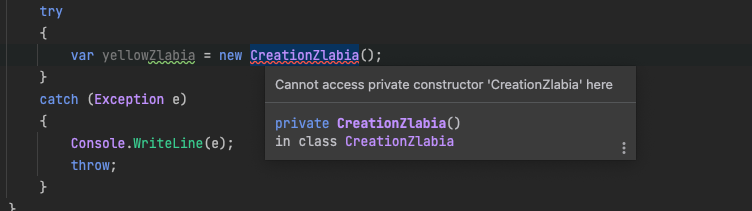

## Singleton

Singleton is a creation design pattern that ensures that the instance of a class exists in only one copy, while providing a global access point to this instance
### Generic scheme seen in class : 

### Concrete version seen with the teacher :

Each class that uses the blank bundle must have access to the same instance.

### Implementation of the Singleton : 

1) Make the default constructor private to prevent other objects from making an instance of it
2) Set up a static method that behaves like a constructor.

Since the constructor is private we can see that the CreationZlabia class can't be **instantiated a second time**.
